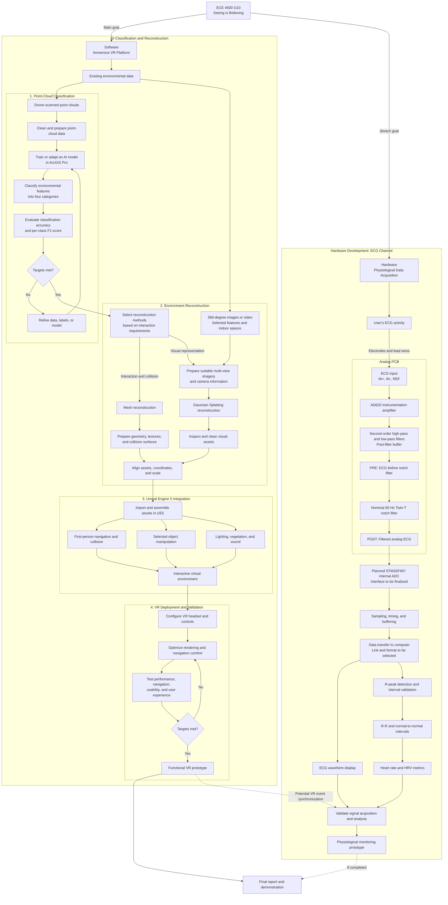

```mermaid
flowchart TB
    START["ECE 4600 G10<br/>Seeing is Believing"]

    START -->|"Main goal"| SOFT["Software<br/>Immersive VR Platform"]
    START -->|"Stretch goal"| HARD["Hardware<br/>Physiological Data Acquisition"]

    %% SOFTWARE
    subgraph SOFTWARE["GI Classification and Reconstruction"]
        direction TB

        SOFT --> DATA["Existing environmental data"]

        DATA --> CLOUD["Drone-scanned point clouds"]
        DATA --> IMAGES["360-degree images or video<br/>Selected features and indoor spaces"]

        subgraph CLASSIFICATION["1. Point-Cloud Classification"]
            direction TB
            CLOUD --> PREP["Clean and prepare point-cloud data"]
            PREP --> MODEL["Train or adapt an AI model<br/>in ArcGIS Pro"]
            MODEL --> CLASS["Classify environmental features<br/>into four categories"]
            CLASS --> EVAL["Evaluate classification accuracy<br/>and per-class F1-score"]
            EVAL --> DECISION{"Targets met?"}
            DECISION -->|"No"| REFINE["Refine data, labels, or model"]
            REFINE --> MODEL
        end

        DECISION -->|"Yes"| PLAN["Select reconstruction methods<br/>based on interaction requirements"]

        subgraph RECONSTRUCTION["2. Environment Reconstruction"]
            direction TB

            PLAN -->|"Interaction and collision"| MESH["Mesh reconstruction"]
            PLAN -->|"Visual representation"| GS_SOURCE["Prepare suitable multi-view imagery<br/>and camera information"]
            IMAGES --> GS_SOURCE

            GS_SOURCE --> GS["Gaussian Splatting reconstruction"]
            MESH --> MESH_READY["Prepare geometry, textures,<br/>and collision surfaces"]
            GS --> GS_READY["Inspect and clean visual assets"]

            MESH_READY --> ALIGN["Align assets, coordinates, and scale"]
            GS_READY --> ALIGN
        end

        subgraph UE_PHASE["3. Unreal Engine 5 Integration"]
            direction TB

            ALIGN --> UE["Import and assemble assets in UE5"]
            UE --> NAV["First-person navigation and collision"]
            UE --> INTERACTION["Selected object manipulation"]
            UE --> ENV["Lighting, vegetation, and sound"]

            NAV --> SCENE["Interactive virtual environment"]
            INTERACTION --> SCENE
            ENV --> SCENE
        end

        subgraph VR_PHASE["4. VR Deployment and Validation"]
            direction TB

            SCENE --> DEPLOY["Configure VR headset and controls"]
            DEPLOY --> OPTIMIZE["Optimize rendering and navigation comfort"]
            OPTIMIZE --> VR_TEST["Test performance, navigation,<br/>usability, and user experience"]
            VR_TEST --> VR_DECISION{"Targets met?"}
            VR_DECISION -->|"No"| OPTIMIZE
            VR_DECISION -->|"Yes"| VR_DONE["Functional VR prototype"]
        end
    end

    %% HARDWARE
    subgraph HARDWARE["Hardware Development: ECG Channel"]
        direction TB

        HARD --> USER["User's ECG activity"]
        USER -->|"Electrodes and lead wires"| INPUT["ECG input<br/>IN+, IN-, REF"]

        subgraph PCB["Analog PCB"]
            direction TB

            INPUT --> AMP["AD620 instrumentation amplifier"]
            AMP --> FILTER["Second-order high-pass and low-pass filters<br/>Post-filter buffer"]
            FILTER --> PRE["PRE: ECG before notch filter"]
            PRE --> NOTCH["Nominal 60 Hz Twin-T notch filter"]
            NOTCH --> POST["POST: Filtered analog ECG"]
        end

        POST --> ADC["Planned STM32F407 internal ADC<br/>Interface to be finalized"]
        ADC --> FIRMWARE["Sampling, timing, and buffering"]
        FIRMWARE --> TRANSFER["Data transfer to computer<br/>Link and format to be selected"]

        TRANSFER --> DISPLAY["ECG waveform display"]
        TRANSFER --> PEAKS["R-peak detection and interval validation"]
        PEAKS --> INTERVALS["R-R and normal-to-normal intervals"]
        INTERVALS --> HRV["Heart rate and HRV metrics"]

        DISPLAY --> HW_TEST["Validate signal acquisition and analysis"]
        HRV --> HW_TEST
        HW_TEST --> HW_DONE["Physiological monitoring prototype"]
    end

    %% PROJECT OUTPUT
    VR_DONE --> FINAL["Final report and demonstration"]
    HW_DONE -.->|"If completed"| FINAL
    VR_DONE -.->|"Potential VR event synchronization"| HW_TEST
```

