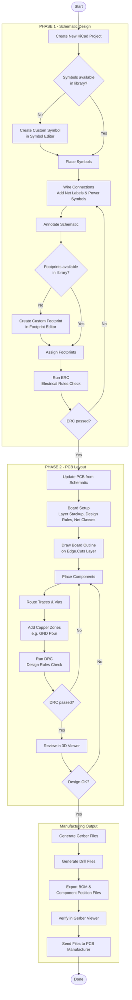

# PCB Design Flowchart in Kicad

```mermaid
flowchart TD
    A([Start]) --> B[Create New KiCad Project]

    subgraph SCH["PHASE 1 - Schematic Design"]
        B --> C{Symbols available<br/>in library?}
        C -- No --> C1[Create Custom Symbol<br/>in Symbol Editor]
        C1 --> D
        C -- Yes --> D[Place Symbols]
        D --> E[Wire Connections<br/>Add Net Labels & Power Symbols]
        E --> F[Annotate Schematic]
        F --> G{Footprints available<br/>in library?}
        G -- No --> G1[Create Custom Footprint<br/>in Footprint Editor]
        G1 --> H
        G -- Yes --> H[Assign Footprints]
        H --> I[Run ERC<br/>Electrical Rules Check]
        I --> J{ERC passed?}
        J -- No --> E
    end

    J -- Yes --> K[Update PCB from Schematic]

    subgraph PCB["PHASE 2 - PCB Layout"]
        K --> L[Board Setup<br/>Layer Stackup, Design Rules, Net Classes]
        L --> M[Draw Board Outline<br/>on Edge.Cuts Layer]
        M --> N[Place Components]
        N --> O[Route Traces & Vias]
        O --> P[Add Copper Zones<br/>e.g. GND Pour]
        P --> Q[Run DRC<br/>Design Rules Check]
        Q --> R{DRC passed?}
        R -- No --> N
        R -- Yes --> S[Review in 3D Viewer]
        S --> T{Design OK?}
        T -- No --> N
    end

    subgraph FAB["Manufacturing Output"]
        T -- Yes --> U[Generate Gerber Files]
        U --> V[Generate Drill Files]
        V --> W[Export BOM &<br/>Component Position Files]
        W --> X[Verify in Gerber Viewer]
        X --> Y[Send Files to PCB Manufacturer]
    end

    Y --> Z([Done])
```

